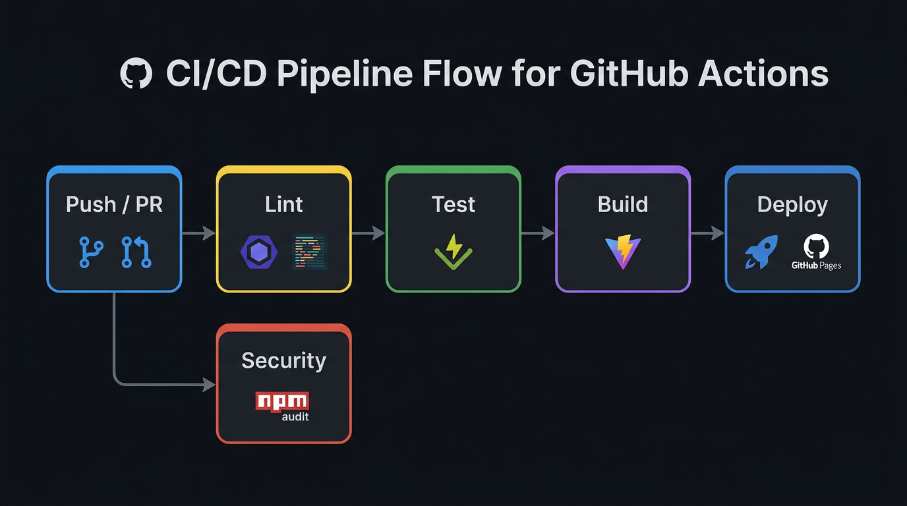
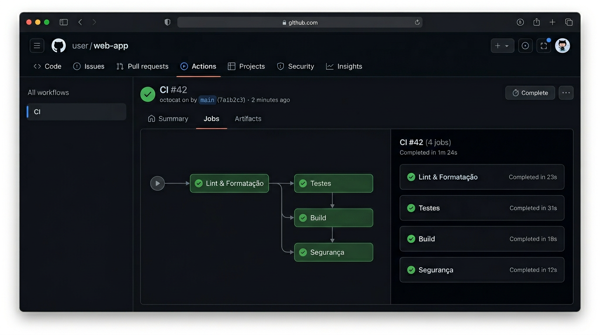
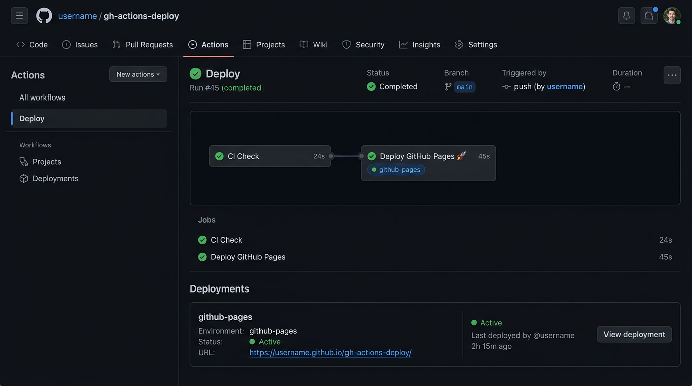

# gh-actions-deploy


Pipeline CI/CD completa usando **GitHub Actions** com deploy automatico no **GitHub Pages**.

---

## Sobre

Este projeto demonstra uma pipeline CI/CD profissional com GitHub Actions, incluindo:

- **Lint** -- ESLint + Prettier para qualidade de codigo
- **Testes** -- Vitest com relatorio de cobertura
- **Build** -- Vite para build otimizado
- **Seguranca** -- Audit automatico de dependencias
- **Deploy** -- GitHub Pages com deploy automatico

---

## Como funciona a Pipeline



A cada **push** ou **pull request** na branch `main`, a pipeline executa automaticamente:

| Etapa         | Ferramenta        | Descricao                                  |
| ------------- | ----------------- | ------------------------------------------ |
| **Lint**      | ESLint + Prettier | Verifica erros e formatacao do codigo      |
| **Testes**    | Vitest            | Roda testes unitarios com cobertura        |
| **Build**     | Vite              | Gera o build otimizado de producao         |
| **Seguranca** | npm audit         | Verifica vulnerabilidades nas dependencias |
| **Deploy**    | GitHub Pages      | Publica automaticamente (apenas na `main`) |

---

## CI -- Integracao Continua

O workflow de CI roda **4 jobs** com dependencias entre eles:



- **Lint & Formatacao** -- roda primeiro
- **Testes** -- so roda se o lint passar
- **Build** -- so roda se os testes passarem
- **Seguranca** -- roda em paralelo (independente)

---

## Deploy -- GitHub Pages

Quando o CI passa com sucesso na `main`, o deploy e feito automaticamente:



O site fica disponivel em:

```
https://isaddorafreitasaugus.github.io/gh-actions-deploy/
```

---

## Tech Stack

| Tecnologia         | Uso                     |
| ------------------ | ----------------------- |
| **Vite**           | Build tool e dev server |
| **ESLint**         | Linter de JavaScript    |
| **Prettier**       | Formatacao de codigo    |
| **Vitest**         | Framework de testes     |
| **GitHub Actions** | CI/CD                   |
| **GitHub Pages**   | Hospedagem              |

---

## Como rodar localmente

```bash
# Clonar o repositorio
git clone https://github.com/IsaddoraFreitasAugus/gh-actions-deploy.git
cd gh-actions-deploy

# Instalar dependencias
npm install

# Rodar em modo de desenvolvimento
npm run dev

# Rodar testes
npm test

# Rodar lint
npm run lint

# Gerar build de producao
npm run build
```

---

## Scripts disponiveis

| Script                  | Descricao                            |
| ----------------------- | ------------------------------------ |
| `npm run dev`           | Inicia o servidor de desenvolvimento |
| `npm run build`         | Gera o build de producao             |
| `npm run preview`       | Preview do build local               |
| `npm run lint`          | Verifica erros com ESLint            |
| `npm run lint:fix`      | Corrige erros automaticamente        |
| `npm run format`        | Formata codigo com Prettier          |
| `npm run format:check`  | Verifica se o codigo esta formatado  |
| `npm test`              | Roda os testes                       |
| `npm run test:watch`    | Testes em modo watch                 |
| `npm run test:coverage` | Testes com relatorio de cobertura    |

---

## Configuracao do GitHub Pages

Para ativar o deploy automatico:

1. Acesse **Settings** > **Pages** no repositorio
2. Em **Source**, selecione **GitHub Actions**
3. Pronto! O deploy sera feito automaticamente a cada push na `main`

---

## Estrutura do Projeto

```
gh-actions-deploy/
|-- .github/
|   +-- workflows/
|       |-- ci.yml              # Workflow de CI
|       +-- deploy.yml          # Workflow de Deploy
|-- src/
|   |-- main.js                 # Entrada da aplicacao
|   |-- utils.js                # Funcoes utilitarias
|   |-- utils.test.js           # Testes unitarios
|   +-- style.css               # Estilos
|-- docs/                       # Imagens do README
|-- index.html                  # Pagina principal
|-- vite.config.js              # Configuracao do Vite
|-- eslint.config.js            # Configuracao do ESLint
|-- .prettierrc                 # Configuracao do Prettier
|-- package.json
+-- README.md
```

---

## Licenca

Este projeto esta sob a licenca MIT.
